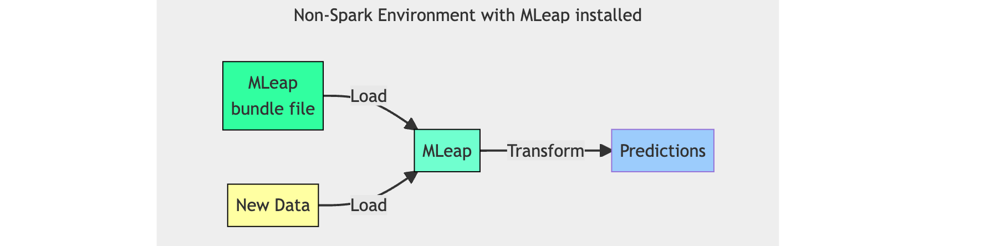

```{r setup, include = FALSE}
knitr::opts_chunk$set(
  collapse = TRUE,
  comment = "#>",
  out.width = "100%",
  fig.align='center',
  eval = TRUE
)

Sys.setenv("JAVA_HOME" = "/Library/Java/JavaVirtualMachines/jdk-18.0.1.1.jdk/Contents/Home")
rJava::.jinit() 
#library(mleap)
devtools::load_all()
library(tibble)
library(sparklyr)

Sys.setenv("JAVA_HOME" = "/usr/local/java")

toc <- function() {
  re <- readLines("README.Rmd")
  has_title <- as.logical(lapply(re, function(x) substr(x, 1, 2) == "##"))
  only_titles <- re[has_title]
  titles <- trimws(gsub("#", "", only_titles))
  links <- trimws(gsub("`", "", titles))
  links <- tolower(links)
  links <- trimws(gsub(" ", "-", links))
  links <- trimws(gsub(",", "", links))
  toc_list <- lapply(
    seq_along(titles),
    function(x) {
      pad <- ifelse(substr(only_titles[x], 1, 3) == "###", "    - ", "  - ")
      paste0(pad, "[", titles[x], "](#",links[x], ")")
    }
  )
  toc_full <- paste(toc_list, collapse = "\n") 
  cat(toc_full)
}

```

<!-- badges: start -->
[](https://github.com/rstudio/mleap/actions/workflows/R-CMD-check.yaml)
[](https://github.com/rstudio/mleap/actions/workflows/mleap-tests.yaml)
[](https://codecov.io/github/rstudio/mleap?branch=master) [](https://cran.r-project.org/package=mleap)
<!-- badges: end -->

## What is MLeap?

[MLeap](https://github.com/combust/mleap) allows us to take Spark pipelines to production. The MLeap runtime can recreate most of Spark's feature transformers 
and model predictions. This allows for the ML Pipeline to be **deployed with no
Spark dependencies**. 


In practice, we can save the ML Pipeline Model (fitted model) as an MLeap bundle 
(see Figure 1). MLeap serializes the pipeline steps and model.  The resulting Zip 
file can  then be used in an external environment that has MLeap. Once the MLeap 
bundle is loaded in the new environment, new data can be passed to obtain 
predictions (see Figure 2).


