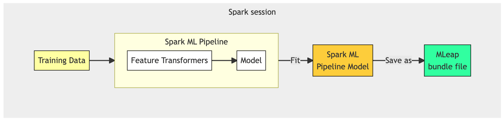
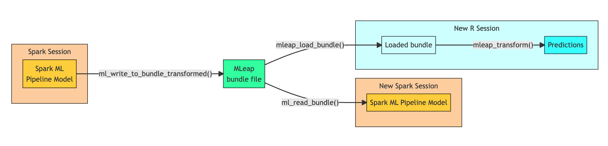

R interface for MLeap
================

<!-- badges: start -->

[](https://github.com/rstudio/mleap/actions/workflows/R-CMD-check.yaml)
[](https://github.com/rstudio/mleap/actions/workflows/mleap-tests.yaml)
[](https://codecov.io/github/rstudio/mleap?branch=master)
[](https://cran.r-project.org/package=mleap)
<!-- badges: end -->

## What is MLeap?

[MLeap](https://github.com/combust/mleap) allows us to take Spark
pipelines to production. The MLeap runtime can recreate most of Spark’s
feature transformers and model predictions. This allows for the ML
Pipeline to be **deployed with no Spark dependencies**.



In practice, we can save the ML Pipeline Model (fitted model) as an
MLeap bundle (see Figure 1). MLeap serializes the pipeline steps and
model. The resulting Zip file can then be used in an external
environment that has MLeap. Once the MLeap bundle is loaded in the new
environment, new data can be passed to obtain predictions (see Figure
2).


## The `mleap` package

The goal of the `mleap` package is twofold:

1.  Convert an ML Pipeline Model created in `sparklyr`, into an MLeap
    bundle file

2.  Load an MLeap bundle file into an R session, and then use the loaded
    bundle for predictions

Additionally, the `mleap` package allows us to load an existing MLeap
bundle into a Spark session. This would typically be to re-train, or
modify a previously created ML Pipeline Model.

The primary functions in `mleap` are:

-   `ml_write_to_bundle_transformed()` - Writes an MLeap bundle. It
    depends on data that has been trained using the pipeline

-   `mleap_load_bundle()` - Loads an MLeap bundle file into R

-   `mleap_transform()` - Runs the MLeap bundle steps against new data
    in R

Additional operational functions in `mleap` are:

-   `ml_read_bundle()` - Loads an MLeap bundle file into Spark, via a
    `sparklyr` session

-   `ml_write_bundle()` - Writes an MLeap bundle. It depends on a sample
    of the training data to re-train the pipeline



## Use Cases

Here are couple of use cases to consider using MLeap, with `mleap`:

-   It opens the door to **collaborate with non-R, and even non-Spark,
    teams**. The resulting MLeap bundle can be used as the integration
    for those teams to use the model in other environments.

-   **Deploy a Shiny app, or a `plumber` API, with no dependencies on
    Spark**. Using `mleap`, the model can be loaded into the R
    environment, and then used for predictions within the R artifact.

## Getting started

In order for the R package to work, we will need a local installation of
MLeap. Maven is required to install MLeap. `mleap` contains functions to
take care of that.

### Steps

1.  **Install `mleap`.** For the CRAN version use:

    ``` r
    install.packages("mleap")
    ```

    For the development version, use:

    ``` r
    devtools::install_github("rstudio/mleap")
    ```

2.  **Install Maven.** If you already have Maven installed, you can let
    `mleap` know by setting an R option:

    ``` r
    options(maven.home = "path/to/maven")`:
    ```

    If no installation of Maven exists, use:

    ``` r
    mleap::install_maven()
    ```

3.  **Install MLeap.** There are a couple of considerations regarding
    the version of MLeap to install:

    -   If using Spark, the version of MLeap to install and use will be
        that closest to the recommended one by the developers of MLeap.
        The `mleap_dep_versions_table()` contains the combinations of
        Spark and MLeap versions as reference.

    -   If not using Spark, meaning, that we are using `mleap` to load
        an existing bundle, then we would need to match the version of
        MLeap in which the bundle was originally created.

    ``` r
    mleap::install_mleap(version = "0.20.0")
    ```

## Example

For the example, we will use the *Fine Foods* example data. It contains
reviews of foods. We will use an ML Pipeline Model to predict if the
verbiage in the review can tell us if the customer thinks if the product
is “great”.

### Create the pipeline

1.  We will use a local version of Spark, version 3.2:

    ``` r
    library(sparklyr)
    library(modeldata)

    data("small_fine_foods")

    sc <- spark_connect(master = "local", version = "3.2")

    sff_training_data <- copy_to(sc, training_data)

    sff_testing_data <- copy_to(sc, testing_data)
    ```

2.  We will create an ML Pipeline. We will index the outcome varaible
    (**score**), and then use several text feature transformers to
    create the **features** column which will be used as our predictor:

    ``` r
    sff_pipeline <- ml_pipeline(sc) %>% 
      ft_string_indexer(
        input_col = "score",
        output_col = "label",
        handle_invalid = "keep",
        string_order_type = "alphabetDesc"
      ) %>% 
      ft_tokenizer(
        input_col = "review",
        output_col = "word_list"
      ) %>% 
      ft_stop_words_remover(
        input_col = "word_list", 
        output_col = "wo_stop_words"
        ) %>% 
      ft_hashing_tf(
        input_col = "wo_stop_words", 
        output_col = "hashed_features", 
        num_features = 4096,
        binary = TRUE
        ) %>%
      ft_normalizer(
        input_col = "hashed_features", 
        output_col = "features"
        ) %>% 
      ml_logistic_regression(elastic_net_param = 0.05, reg_param = 0.25)
    ```

3.  An ML Pipeline Model is now created after running the training data
    through the pipeline created in the previous step:

    ``` r
    sff_pipeline_model <- ml_fit(sff_pipeline, sff_training_data)
    ```

4.  Assuming we are happy with the results. We run the same pipeline
    using the hold-out set (`sff_testing_data`). The idea, is that we
    can use this last transformed data set as a base for our MLeap
    bundle.

    ``` r
    sff_test_predictions <- sff_pipeline_model %>% 
      ml_transform(sff_testing_data)
    ```

5.  Using `ml_write_to_bundle_transformed()` from `mleap`, we save the
    new ML Pipeline Model as an MLeap bundle. We also pass the
    transformed data set we created with the hold-out test set.

    ``` r
    ml_write_to_bundle_transformed(
      x = sff_pipeline_model,  
      transformed_dataset = sff_test_predictions,  
      path = "sff.zip", 
      overwrite = TRUE
      )
    #> Model successfully exported.
    ```

6.  We can now close the Spark connection

    ``` r
    spark_disconnect(sc) 
    ```

### Loading an MLeap bundle to R (without Spark dependencies)

1.  We can use the same bundle created in the previous section to load
    into R. Simply pass the path to the Zip file to `ml_load_bundle()`:

    ``` r
    sff_mleap_model <- mleap_load_bundle("sff.zip")

    sff_mleap_model
    #> MLeap Transformer
    #> <d04e078a-2786-4e5e-923b-cea0ba0ca392> 
    #>   Name: pipeline__4ac614f9_18a1_48f0_ac53_d4d03ca86464 
    #>   Format: json 
    #>   MLeap Version: 0.20.0
    ```

2.  We can use `mleap_model_schema()` to view more information about the
    contents of the bundle:

    ``` r
    mleap_model_schema(sff_mleap_model)
    #> # A tibble: 10 × 5
    #>    name            type   nullable dimension io    
    #>    <chr>           <chr>  <lgl>    <chr>     <chr> 
    #>  1 review          string FALSE    <NA>      input 
    #>  2 score           string TRUE     <NA>      input 
    #>  3 wo_stop_words   string TRUE     <NA>      output
    #>  4 word_list       string TRUE     <NA>      output
    #>  5 features        double TRUE     (4096)    output
    #>  6 label           double FALSE    <NA>      output
    #>  7 hashed_features double TRUE     (4096)    output
    #>  8 prediction      double FALSE    <NA>      output
    #>  9 rawPrediction   double TRUE     (3)       output
    #> 10 probability     double TRUE     (3)       output
    ```

3.  `mleap_transform()` can process the model and new data. Pass a
    `tibble` with the expected **input** variables:

    ``` r
    tibble(review = "worst bad thing I will never buy again", score = "") %>% 
      mleap_transform(sff_mleap_model, .) %>% 
      glimpse()
    #> Rows: 1
    #> Columns: 10
    #> $ review          <chr> "worst bad thing I will never buy again"
    #> $ score           <chr> ""
    #> $ label           <dbl> 2
    #> $ word_list       <list> ["worst", "bad", "thing", "i", "will", "never", "buy",…
    #> $ wo_stop_words   <list> ["worst", "bad", "thing", "never", "buy"]
    #> $ hashed_features <list> [[[433], [768], [2020], [3081], [4092]], [1, 1, 1, 1, …
    #> $ features        <list> [[[433], [768], [2020], [3081], [4092]], [0.4472136, 0…
    #> $ rawPrediction   <list> [[6.00653, 5.469893, -11.47642], [3]]
    #> $ probability     <list> [[0.6310298, 0.3689702, 1.611768e-08], [3]]
    #> $ prediction      <dbl> 0
    ```

    ``` r
    tibble(review = "I really loved the proudct best product", score = "") %>% 
      mleap_transform(sff_mleap_model, .) %>% 
      dplyr::glimpse()
    #> Rows: 1
    #> Columns: 10
    #> $ review          <chr> "I really loved the proudct best product"
    #> $ score           <chr> ""
    #> $ label           <dbl> 2
    #> $ word_list       <list> ["i", "really", "loved", "the", "proudct", "best", "pr…
    #> $ wo_stop_words   <list> ["really", "loved", "proudct", "best", "product"]
    #> $ hashed_features <list> [[[2187], [2365], [3229], [3727], [3984]], [1, 1, 1, 1…
    #> $ features        <list> [[[2187], [2365], [3229], [3727], [3984]], [0.4472136,…
    #> $ rawPrediction   <list> [[4.768167, 6.708236, -11.47642], [3]]
    #> $ probability     <list> [[0.1256402, 0.8743598, 1.107122e-08], [3]]
    #> $ prediction      <dbl> 1
    ```

## Known limitations

MLeap translates the feature transformer and models into its own code
base. Not everything available in Spark is translated.

This means two layering things:

1.  No `dplyr` transformation is available. Only models and feature
    transformers are available. In `sparklyr`, feature transformers are
    functions that start with `ft_`.

2.  Not every Spark Feature Transformer and model are supported. Please
    refer to the MLeap documentation to see a concise view of what is
    available: [MLeap Supported Transformers &
    Models](https://combust.github.io/mleap-docs/core-concepts/transformers/support.html).

Most notably, the following three transformers are not supported:

-   `ft_dplyr_transformer()`
-   `ft_sql_transformer()`
-   `ft_r_formula()`

There is a **workaround for `ft_r_formula()`**. It involves using the ML
Pipeline “way” of setting up the outcome and predictors. For the
predictors, use `ft_vector_assembler()` if the final stage of the
predictors is not a single vectorized variable. For outcomes, anything
numeric works fine, but anything categorical will not. Use
`ft_string_indexer()` on top of the outcome variable, before passing it
to the modeling step (See the Example section).
